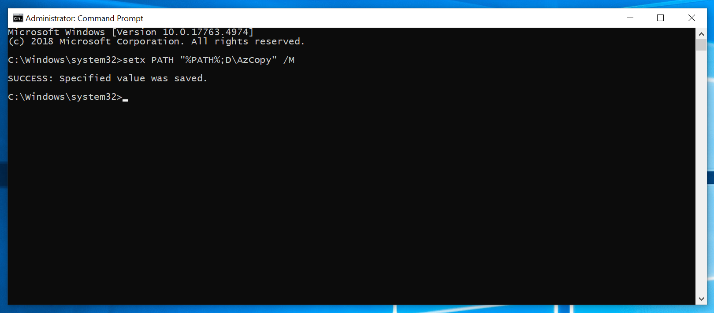
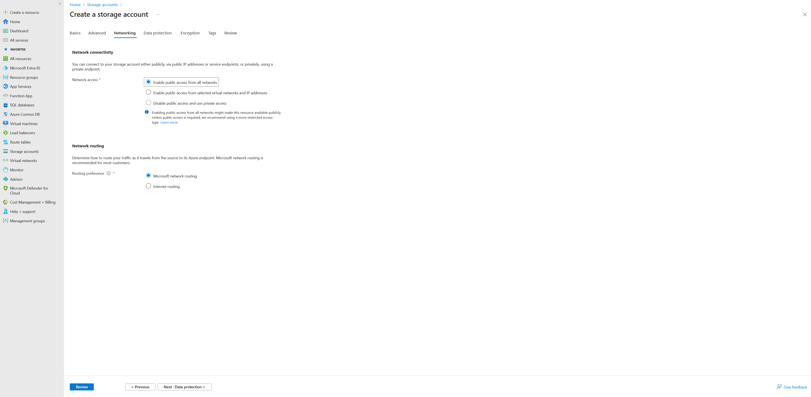
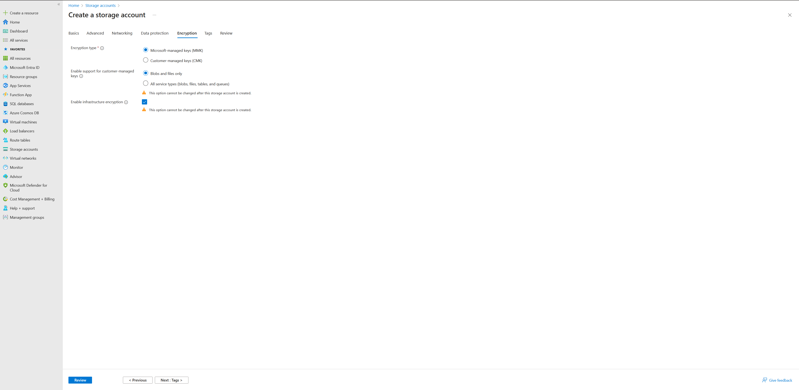
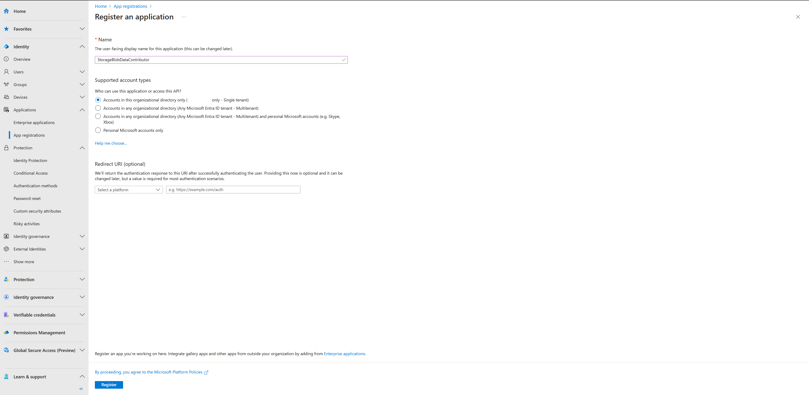
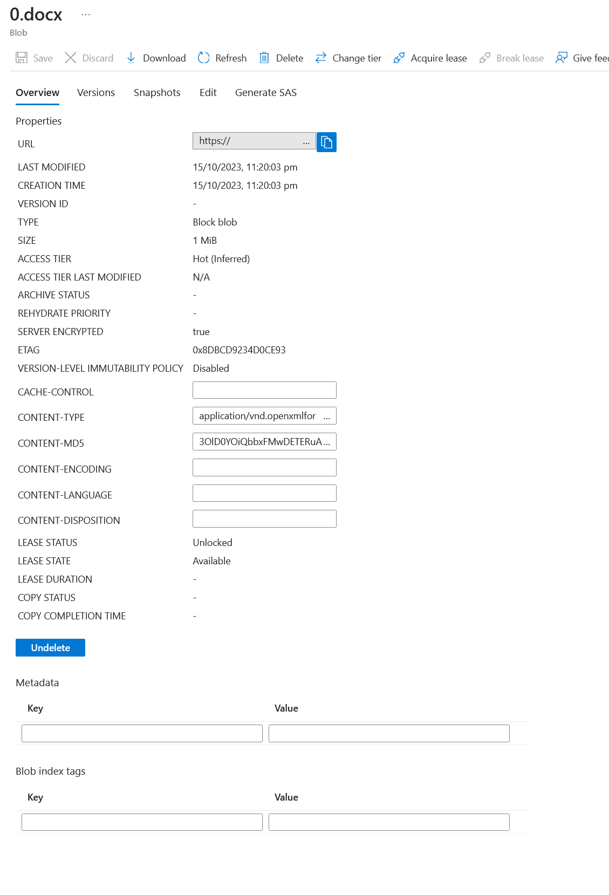
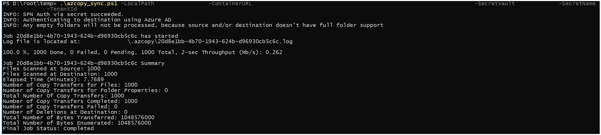

# Using AzCopy to Sync Files to Azure Blob Storage

- [Using AzCopy to Sync Files to Azure Blob Storage](#using-azcopy-to-sync-files-to-azure-blob-storage)
  - [Prerequisites](#prerequisites)
  - [Step 1: Create Azure Blob Storage](#step-1-create-azure-blob-storage)
  - [Step 2: Secure Your Azure Blob Storage](#step-2-secure-your-azure-blob-storage)
  - [Step 3: User PowerShell Password SecretManagement to store the Service Principal credentials](#step-3-user-powershell-password-secretmanagement-to-store-the-service-principal-credentials)
  - [Step 4: Use AzCopy to Sync Files](#step-4-use-azcopy-to-sync-files)
    - [Retrieve SPN details from the vault](#retrieve-spn-details-from-the-vault)
    - [AzCopy Autologin](#azcopy-autologin)
    - [AzCopy Command](#azcopy-command)
  - [Troubleshooting: Find errors and resume jobs](#troubleshooting-find-errors-and-resume-jobs)
  - [Scheduled Tasks](#scheduled-tasks)
  - [Conclusion](#conclusion)

In today's digital age, data management is crucial for businesses and individuals alike. Azure Blob Storage, a part of Microsoft Azure's cloud offerings, is a scalable object storage solution that allows you to store and manage unstructured data, such as documents, images, and videos. One powerful tool for managing data in Azure Blob Storage is AzCopy. AzCopy is a command-line utility that enables you to copy, transfer, and sync data to and from Azure Blob Storage efficiently. In this comprehensive guide, we will walk you through all the necessary steps, from creating Azure Blob Storage to securely authenticating AzCopy using a Service Principal Name (SPN). Additionally, we will discuss how to enhance the security of the SPN using PowerShell Secrets.

## Prerequisites

Before we dive into the steps, let's ensure we have the following prerequisites in place:

- An Azure account: You'll need an Azure account to create Azure Blob Storage and obtain access keys. If you don't have an account, you can sign up for a free Azure trial.
- AzCopy installed: You can download AzCopy from the official [AzCopy GitHub repository](https://github.com/Azure/azure-storage-azcopy). AzCopy is available for Windows, Linux, and macOS.
  - Refer to <https://aka.ms/azcopy> for more details.
  - For Windows machines, add AzCopy to your system's PATH 

    ```bash
    setx PATH "%PATH%;D\AzCopy" /M
    ```

- PowerShell 7 installed: You can download PowerShell 7 from the official [PowerShell GitHub repository](https://github.com/PowerShell/PowerShell)
  
## Step 1: Create Azure Blob Storage

There are several ways to create Azure resources, including Azure Blob Storage. In this guide, we will use the Azure Portal to create Azure Blob Storage. Here's how to do it:

1. Log in to the [Azure Portal](https://portal.azure.com/).
2. Click on "Create a resource" and search for "Storage account."
3. Click on "Storage account" and then "Create" to start the creation process.
   
4. Provide the necessary details such as resource group, storage account name, location, and performance options.
5. In the Advanced section, unselect 'Enable storage account key access' to ensure that the storage account can only be accessed using Azure AD credentials.
   
6. In the Networking section, under Network Connectivity, select appropriate option for your scenario. For example, if you want to access the storage account from the internet, select 'Enable public access from all networks'.
   
7. Select appropriate options for the Data protection sections.
8. Under the Encryption section, ensure that 'Enable infrastructure encryption' is selected.
   
9. Add appropriate tags for your environment and click "Review", review the settings, and then click "Create" to create the storage account.

To learn how to create or deploy a new storage account, refer to the official [Azure Training Module](https://learn.microsoft.com/en-us/training/modules/create-azure-storage-account/).

## Step 2: Secure Your Azure Blob Storage

**Part A** : Ensure the Public access is disabled on the Storage blob.

Refer to step 6 in the above section for storage access `publicNetworkAccess` (internet vs public hosted.)

Select the Azure storage account, and chose 'Export template' under Automation section. This will export the ARM template for the storage account. Verify that `allowBlobPublicAccess` is set to false in the storage properties.

```JSON
            "properties": {
                "dnsEndpointType": "Standard",
                "defaultToOAuthAuthentication": false,
                "publicNetworkAccess": "Enabled",
                "allowCrossTenantReplication": false,
                "minimumTlsVersion": "TLS1_2",
                "allowBlobPublicAccess": false,
                "allowSharedKeyAccess": false,
                "networkAcls": {
                    "bypass": "AzureServices",
                    "virtualNetworkRules": [],
                    "ipRules": [],
                    "defaultAction": "Deny"
                },
                "supportsHttpsTrafficOnly": true,
                "encryption": {
                    "requireInfrastructureEncryption": true,
                    "services": {
                        "file": {
                            "keyType": "Account",
                            "enabled": true
                        },
                        "blob": {
                            "keyType": "Account",
                            "enabled": true
                        }
                    },
                    "keySource": "Microsoft.Storage"
                },
                "accessTier": "Hot"
            }
```

**Part B**: Create an Entra ID Service Principal Name (SPN) for AzCopy

Now, we'll create an SPN, which is a security identity used to authenticate AzCopy to your Azure resources.

You must have sufficient permissions to register an application with your Microsoft Entra tenant, and assign to the application a role in your Azure subscription. To complete these tasks, you require `Application.ReadWrite.Allpermission`.

- Sign in to the Microsoft Azure admin center as at least a Cloud Application Administrator.
- Browse to Identity > Applications > App registrations then select New registration.
- Name the application, for example "StorageBlobDataContributor".
- Select a supported account type, select 'Accounts in this organizational directory only (tenantname only - Single tenant)
- Select Register.
   
- Select Certificates & secrets > New client secret. Note down this secret as it will be used later.

**Part C**: Assign the SPN to the Storage account

The level of authorization that is needed is based on whether you plan to upload files or just download them. If you just want to download files, then verify that the `Storage Blob Data Reader`` role has been assigned to the service principal.

If you want to upload files, then verify that one of these roles has been assigned to your security principal:

- [Storage Blob Data Contributor](https://learn.microsoft.com/en-us/azure/role-based-access-control/built-in-roles#storage-blob-data-contributor)
- [Storage Blob Data Owner](https://learn.microsoft.com/en-us/azure/role-based-access-control/built-in-roles#storage-blob-data-owner)

To learn how to verify and assign roles, see [Assign an Azure role for access to blob data](https://learn.microsoft.com/en-us/azure/storage/blobs/assign-azure-role-data-access?tabs=portal).

Rule of the least privilege: Ensure that the SPN has the minimum required permissions to perform the required tasks. For example, if you only want to upload files, then assign the Storage Blob Data Contributor role to the SPN.

You may further restrain permitted actions on the storage, but using [Azure attribute-based access control](https://learn.microsoft.com/en-us/azure/role-based-access-control/conditions-overview) for more details.

## Step 3: User PowerShell Password SecretManagement to store the Service Principal credentials

The PowerShell SecretManagement module offers a user-friendly method for securely storing and retrieving sensitive information. These secrets are safeguarded within SecretManagement extension vaults, which are essentially PowerShell modules registered with SecretManagement. These extension vaults expose the five necessary module functions for SecretManagement. Secrets can be stored either locally or remotely within an extension vault. It's important to note that extension vaults are associated with the current user's context upon registration, ensuring they remain exclusively accessible to that specific user. SecretStore is the Local secure store extension vault for Microsoft.PowerShell. SecretManagement module.

The first time you access the vault you must provide a password for the new vault. This password is used to lock and unlock the vault.<sup id="fnref:1">[1]</sup>. The password is stored in a file on the local machine. The file is encrypted using the Windows Data Protection API (DPAPI) and can only be decrypted by the user who created the vault. The password is not stored in the registry or in a file that is accessible to other users.

```powershell
    # Secret Management
    # https://learn.microsoft.com/en-us/powershell/utility-modules/secretmanagement/overview?view=ps-modules 
    # Requirement: Powershell 7 (SecretStore uses .NET Core cryptographic APIs to encrypt file contents)

    #Install SecretManagement & SecretStore
    Install-Module -Name Microsoft.PowerShell.SecretManagement -Repository PSGallery
    Install-Module -Name Microsoft.PowerShell.SecretStore -Repository PSGallery

    # Get Help 
    # Get-Command -Module Microsoft.PowerShell.SecretManagement
    # Get-Command -Module Microsoft.PowerShell.SecretStore

    # Load the PowerShell modules for SecretManagement and SecretStore
    Import-Module Microsoft.PowerShell.SecretManagement
    Import-Module Microsoft.PowerShell.SecretStore

    # The first time a vault is created, a master password is created to secure the vault. 
    $credential = Get-Credential -UserName 'SecureStore'
    $securePasswordPath = 'C:\Path\passwd.xml'
    $credential.Password |  Export-Clixml -Path $securePasswordPath

    # Register a master password for storing secrets securely
    $parameters = @{
        Name = 'BlobVault'                                       # The name of the vault to be registered
        ModuleName = 'Microsoft.PowerShell.SecretStore'     # The name of the module that provides the vault implementation
        DefaultVault = $true                                # Indicates whether this vault should be the default vault for the current user
        AllowClobber = $true                                # Indicates whether to overwrite an existing vault with the same name
        Description = 'This vault is registered to store SPN credentials to connect to Storage Blob'  # A description of the vault
        Confirm = $false                                    # Indicates whether to prompt the user for confirmation before executing the command
    }
    Register-SecretVault @parameters

    $password = Import-CliXml -Path $securePasswordPath
    Unlock-SecretStore -Password $password
    # Create secrets to store SPN details for AzCopy

    # Define the SPN client ID and secret
    $SPNClientId = "{GUID}"
    $SPNSecret = "{Stored in Step 3, Part B}"

    # Create a JSON object containing both SPN details
    $SPNDetails = @{
        "ServicePrincipalId" = $SPNClientId
        "ServicePrincipalSecret" = $SPNSecret
    }

    # Get Vault name
    $Vault = Get-SecretVault -Name SFTP

    # Set the secret in the vault
    Set-Secret -Vault $Vault.Name -Name "StorageSPN" -Secret $SPNDetails
```
<!-- markdownlint-disable MD033 -->
[1]:<a href="#fn:1"> Note the master password to your vault securely. If you lose the master password, you will not be able to retrieve the secrets stored in the vault.</a>

Find a copy of the above script [here](./azcopy-sync-scripts/secrets.ps1)

## Step 4: Use AzCopy to Sync Files

Now that you have your Azure Blob Storage set up and secured and Service Principal Storage securely, you can use AzCopy to sync files.

Synchronization with Azure Blob Storage offers diverse capabilities. You can effortlessly synchronize the content of your local file system with an Azure Blob container, allowing you to efficiently manage data. This synchronization process is one-way, where you choose the source and destination endpoints. It leverages server-to-server APIs for robust and reliable data transfer. The present version of AzCopy does not support synchronization between sources and destinations beyond its native environment. This means it cannot synchronize with external sources or destinations such as File storage or Amazon Web Services (AWS) S3 buckets.

Refer to the script supplied for details on how to achieve this [azcopysync.ps1](./azcopy-sync-scripts/azcopysync.ps1)

Summary of the process

- Retrieve the SPN details from the vault
- AzCopy Autologin
- Azcopy Command

### Retrieve SPN details from the vault

Use the parameters supplied to the script and retrieve the SPN details from the vault.

```powershell
# Retrieve the SPN details from the vault
$securePasswordPath = '{Path}\passwd.xml'
$password = Import-CliXml -Path $securePasswordPath
Unlock-SecretStore -Password $password

# Get Vault name
$Vault = Get-SecretVault -Name $SecretVault

# Get the secret stored in the local vault
$Secret = Get-Secret -Vault $Vault.Name -Name $SecretName -AsPlainText
```

### AzCopy Autologin

AzCopy's "Auto-Login" is a feature designed to streamline the process of authentication when using AzCopy, which is a command-line utility for data transfer and synchronization with Azure services. Auto-Login simplifies the authentication process by allowing users to pre-configure their credentials, including Service Principal Name (SPN) details, so they don't need to provide them every time they run AzCopy commands. This feature is available for both Windows and Linux.

```powershell
    # Log in to Azcopy using Auto-login with the Service Principal credentials
    $env:AZCOPY_AUTO_LOGIN_TYPE= "SPN"
    $env:AZCOPY_SPA_APPLICATION_ID= $ServicePrincipalId
    $env:AZCOPY_SPA_CLIENT_SECRET= $ServicePrincipalSecret
    $env:AZCOPY_TENANT_ID= $TenantId
```

### AzCopy Command

AzCopy supports many modes of operation. Refer to [Microsoft guide](https://learn.microsoft.com/en-us/azure/storage/common/storage-ref-azcopy?toc=%2Fazure%2Fstorage%2Fblobs%2Ftoc.json&bc=%2Fazure%2Fstorage%2Fblobs%2Fbreadcrumb%2Ftoc.json#see-also0) to learn more about the commands

In this scenario, we use the `azcopy sync` command to sync files from the local file system to the Azure Blob Storage.

```powershell
    azcopy sync [flags]
```

Azcopy sync supports many flags, we will utilize the `--compare-hash` and `--put-md5` flags here. By default, the sync command compares file names and last modified timestamps. You can override that behavior to use MD5 hashes instead of last modified timestamps by using the --compare-hash flag.

NOTE: If you don't plan to use the --compare-hash flag, then the machine on which you run the sync command should have an accurate system clock because the last modified times are critical in determining whether a file should be transferred. If your system has significant clock skew, avoid modifying files at the destination too close to the time that you plan to run a sync command.

```powershell
    # Set the arguments for the AzCopy command
    $AzCopyArgs = @(
        "sync",                 # Synchronize files command
        $LocalPath,             # Local folder to be synchronized
        $ContainerURL,          # Azure Storage container URL
        "--compare-hash=MD5",   # Compare files using MD5 hash
        "--put-md5",            # Set the MD5 hash of the file as the Content-MD5 property of the blob
        "--recursive"           # Synchronize subdirectories recursively
    )

    # Build the AzCopy command
    $azCopyCommand = "azcopy " + ($AzCopyArgs -join " ")
```

The flag `--put-md5` creates an MD5 hash of each file, and save the hash as the Content-MD5 property of the destination blob or file. (By default the hash is NOT created.) Only available when uploading.



The script should provide an output as below

 

## Troubleshooting: Find errors and resume jobs

AzCopy provides a detailed log of all the operations performed during a sync job. This log is stored in a file named `azcopy.log` in the same directory as the AzCopy executable. You can use this log to find errors and resume jobs.

Refer to the [Microsoft guide](https://learn.microsoft.com/en-us/azure/storage/common/storage-use-azcopy-configure?toc=%2Fazure%2Fstorage%2Fblobs%2Ftoc.json&bc=%2Fazure%2Fstorage%2Fblobs%2Fbreadcrumb%2Ftoc.json) for more information.

## Scheduled Tasks

Create a batch file to run the task and store it in the same location as PowerShell script.

Scheduled task command switch '/TR' option cannot be more than 261 character(s).

```powershell
    @echo off
    powershell.exe -ExecutionPolicy Bypass -File ".\azcopysync.ps1" -LocalPath "C:\Data" -ContainerURL "https://mystorage.blob.core.windows.net/mycontainer" -SecretVault "MyVault" -SecretName "MySecret" -TenantId "MyTenantId"
```

Now add a scheduled task to run the batch file on schedule

```command
schtasks /Create /SC DAILY /TN "MyScheduledTask" /TR "D:\temp\mytask.bat" /ST 08:00 /RU "NT AUTHORITY\SYSTEM" /RP /SD 15/10/2023
```

## Conclusion

In this guide, we have discussed how to use AzCopy to sync files to Azure Blob Storage. We have also covered how to create Azure Blob Storage, secure it, and authenticate AzCopy using a Service Principal Name (SPN). Additionally, we have discussed how to enhance the security of the SPN using PowerShell Secrets. We hope this guide has been helpful in understanding how to use AzCopy to sync files to Azure Blob Storage.
