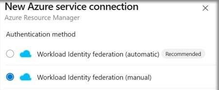
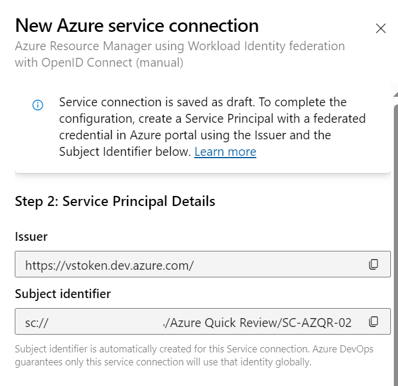
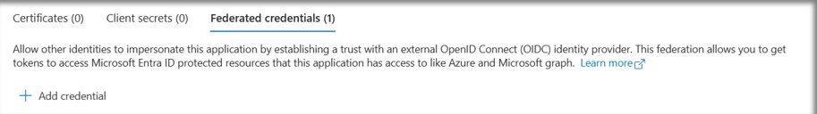
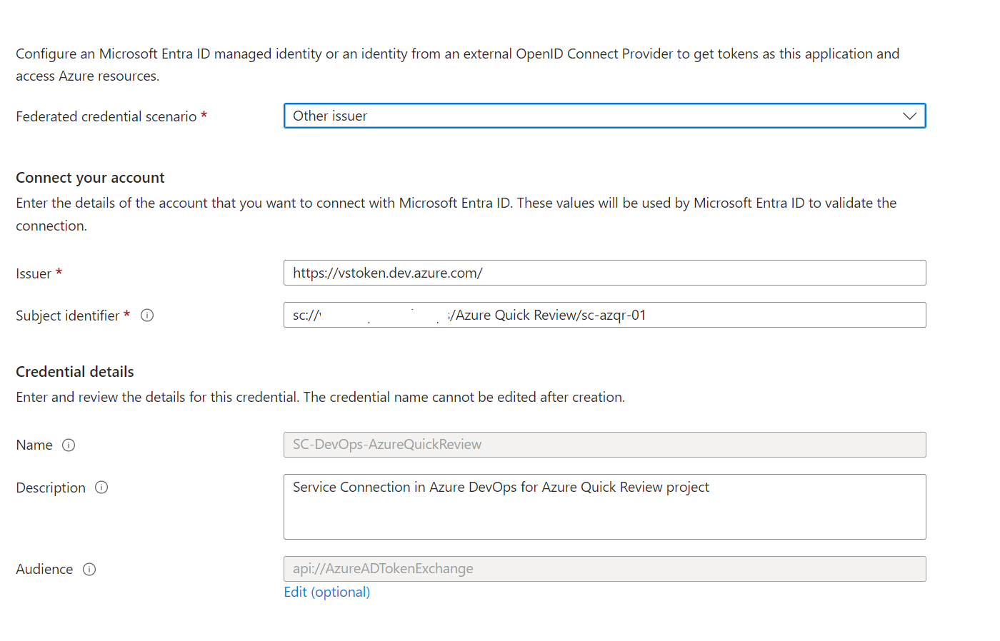
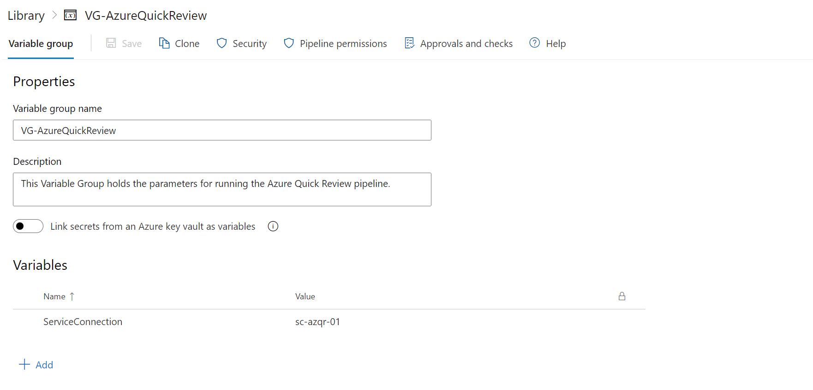
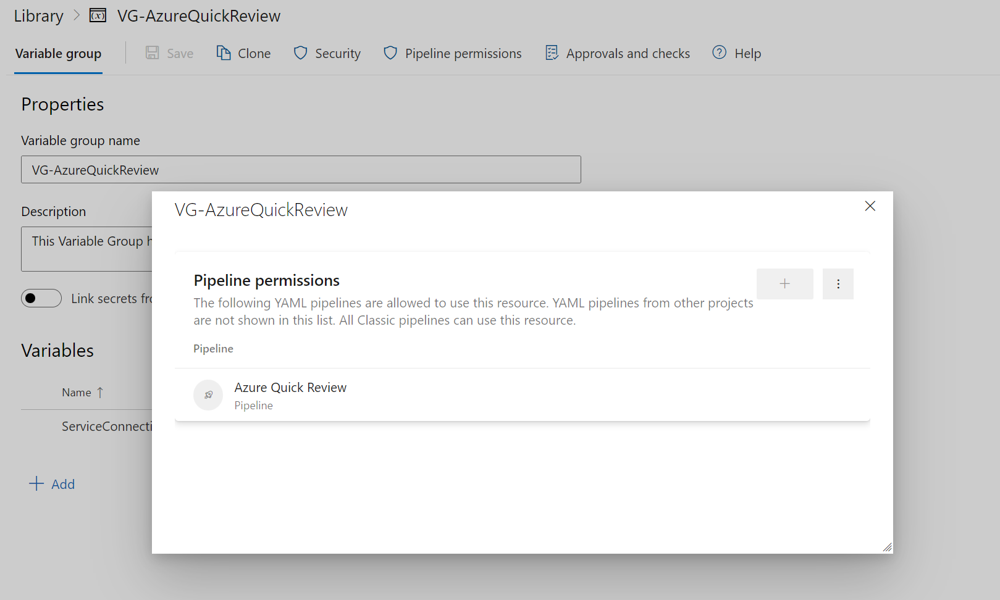

# Use Azure DevOps Pipeline to run Azure Quick Review

- [Use Azure DevOps Pipeline to run Azure Quick Review](#use-azure-devops-pipeline-to-run-azure-quick-review)
  - [Overview](#overview)
  - [Automate scans](#automate-scans)
  - [Azure DevOps Project](#azure-devops-project)
  - [Create Azure DevOps Pipeline service connection](#create-azure-devops-pipeline-service-connection)
  - [Create app registration in Microsoft Entra ID](#create-app-registration-in-microsoft-entra-id)
  - [Role Assignment](#role-assignment)
  - [Complete Service Connection in Azure DevOps](#complete-service-connection-in-azure-devops)
  - [Setup DevOps Pipeline](#setup-devops-pipeline)
  - [Establish an Azure DevOps Wiki (WikiAsCode)](#establish-an-azure-devops-wiki-wikiascode)
  - [References](#references)

## Overview

The Azure Quick Review (azqr) tool is a command-line interface designed to analyze Azure resources for compliance with Azure’s best practices and recommendations.

Read more [here](https://azure.github.io/azqr/docs/)

## Automate scans

If you would like to run the scan periodically without manual intervention, set up a DevOps pipeline and upload the scan results to the repository.

## Azure DevOps Project

1. Create a new Azure DevOps Project.
2. In Project Settings Overview, turn off Boards, Test Plans, and Artifacts, as they are not needed for this project.
3. Grant permissions for Build service to write files into repository. Go to Settings, Repositories, and under the Security tab, select the User: : `{ProjectName}} Build Service (DevOpsOrgName)` and set Contribute to Allow. (no save button available)

## Create Azure DevOps Pipeline service connection

For pipelines to authenticate and connect to Azure you need to create an Azure Resource Manager service connection. This will allow the Azure Quick Review pipeline to connect to Azure resources under the identity of a service principal.

There are a few options to create the service connection, but we will create a Microsoft Entra ID workload identity federation to manage a service principal which eliminates the need for managing secrets or their expiration.

1. Open your project in Azure DevOps.
2. Click on 'Project settings' (located on the bottom left)
3. Under 'Pipelines' click on 'Service Connections'
4. Click on 'New service connection' and select the connection/service type 'Azure Resource Manager' and click 'Next'
5. Select Authentication method Workload Identity federation (manual)
    
6. Give the connection a meaningful name and description.
7. For 'Security' leave the 'Grant access permissions to all pipelines' option checked (optional)
8. Copy the values of the following results, as you'll need those in the next set of steps for Microsoft Entra ID configuration.
   - Issuer
   - Subject identifier
    

Before proceeding, create the service principal.

## Create app registration in Microsoft Entra ID

Next move to Microsoft Entra ID to create a service principal before continuing creating the Azure service connection.

1. In a new browser tab, navigate to the Microsoft Entra admin center
2. Click on 'App registrations'
3. Click on 'New registration'
4. Name your application (e.g. 'SPN - Azure Quick Review')
5. Click 'Register'
6. Your App registration has been created
7. Copy (note) the 'Application (client) ID', as you'll need it back in Azure DevOps.
8. Under 'Manage' click on 'Certificates & Secrets'
9. Click on 'Federated credentials' and 'Add credential'
    
10. Select `Other issuer` and paste the values copied in a prior step.
    - Issuer
    - Subject identifier
11. Enter Credential Name. Description and save.
    

## Role Assignment

Next we need to assign the service principal permission on the Azure tenant to be able to scan all subscriptions. Select a scope, say Management group level, such that it covers all subscriptions you want to scan using Azure Quick review. Assign the service principal created above to get `Reader` role permissions on the target management group scope.

1. In the Azure portal proceed to 'Management Groups', select the scope at which Azure Quick Review will run. This is usually the Tenant Root Group.
2. Go to 'Access Control (IAM)', 'Grant Access' and 'Add Role Assignment', select 'Reader', click 'Next'
3. Now 'Select Member', this will be the name of the Application you created above (e.g. 'SPN - Azure Quick Review').
4. Select 'Next', 'Review + Assign'

## Complete Service Connection in Azure DevOps

1. Return to the tab with the "New Azure service connection" workflow in Azure DevOps and continue from where you left off.
2. For the 'Scope level' select 'Management Group'
   - In the field 'Management Group Id' enter the target Azure management group ID
   - In the field 'Management Group Name' enter the target Azure management group name
3. Under 'Authentication' in the field 'Service Principal Id' enter the 'Application (client) ID' that you noted earlier.
4. For 'Tenant ID' enter your Microsoft Entra tenant ID.
5. Click on 'Verify and save'

## Setup DevOps Pipeline

1. Open your project in Azure DevOps.
2. Go to Pipelines, click on New Pipeline and Select Azure Repos Git (unless you use a different repo)
3. Select the Azure Quick Review Repository and click Next.
4. On the 'Configure your pipeline' screen, you can choose Starter Pipeline. If you prefer to download the below pipeline and store it in advance, you can simply open the existing YAML file at this stage.
5. I have written the below pipeline to run Azure Quick Review. You can copy the code, make adjustments and Save the YAML once done (don't hit `Save and run` yet, there is one more step to complete).
6. Notes:
   1. *I have used a `azqr.exclude.yaml` file to exclude subscriptions or resources I don't want to be included in the scan (example, Visual Studio Subscriptions)*
   2. *If the folder structure gives an error on pipeline run, create the `azqr-results` folder in repo in advance.*
   3. *I have stored the pipeline file in a folder named `.azuredevops`. Use an appropriate folder structure for your repository.*
   4. *I have set the PowerShell script to delete files older than 365 days, adjust the days as required.*
   5. *See [Readme](#establish-an-azure-devops-wiki-wikiascode) for more options like creating Excel files instead of CSV.*

    ```YML
        # -----------------
        # Azure Quick Review Pipeline - This pipeline runs the Azure Quick Review executable
        # documentation: https://azure.github.io/azqr/docs/usage/
        # author: {Author}
        # created: YYYY-MM-DD
        # modified: YYYY-MM-DD
        # version: N.N
        
        # specific branch build with batching
        trigger: none
        
        pr: none
        
        # use variable group in DevOps for service connection details.
        variables:
        - group: VG-AzureQuickReview
        
        schedules:
        - cron: "0 0 * * Mon"
        displayName: Weekly Schedule
        always: true
        branches:
            include:
            - main
        
        jobs:
        - job: AzureQuickReview
        timeoutInMinutes: 0
        
        pool:
            vmImage: 'windows-latest'
        steps:
        - checkout: self
            fetchDepth: 1
        
        - task: PowerShell@2 # Download the latest version of Azure Quick Review
            inputs:
            pwsh: true  # Use PowerShell Core
            targetType: 'inline'
            script: |
                Write-Host "Fetching the latest version of Azure Quick Review..."
                $latest_azqr = (iwr https://api.github.com/repos/Azure/azqr/releases/latest).content | ConvertFrom-Json | Select-Object -ExpandProperty tag_name
                Write-Host "Downloading Azure Quick Review version $latest_azqr..."
                iwr https://github.com/Azure/azqr/releases/download/$latest_azqr/azqr-windows-latest-amd64.exe -OutFile azqr.exe
            displayName: 'Download Azure Quick Review'
            env:
            SYSTEM_ACCESSTOKEN: $(System.AccessToken)
        
        - task: AzureCLI@2  # Run Azure Quick Review and handle the output
            inputs:
            azureSubscription: '$(ServiceConnection)'  # Use the variable from the variable group
            scriptType: ps
            scriptLocation: inlineScript
            addSpnToEnvironment: true
            inlineScript: |
                Write-Host "Running Azure Quick Review..."
                .\azqr.exe scan --exclusions ./.azuredevops/azqr.exclude.yaml --mask=false --costs=true
                Move-Item -Path "*.csv" -Destination ./azqr-results -Force
                Get-ChildItem -Path ./azqr-results -Recurse -Force -ea 0 | Where-Object { !$_.PSIsContainer -and $_.LastWriteTime -lt (Get-Date).AddDays(-365) } | Remove-Item -Force
            displayName: 'Run Azure Quick Review'
        
        - pwsh: | # Push the output of Azure Quick Review back to the repository
            write-host "#################################"
            write-host "Push Azure Quick Review output to repository"
            write-host "#################################"
            $executionDateTimeInternationalReadable = get-date -format "dd-MMM-yyyy HH:mm:ss"
            $currentTimeZone = (Get-TimeZone).Id
            git config --global user.email "AzureQuickReviewPipeline@azdo.com"
            $PipelineInfo = "Pipeline: '$(Build.DefinitionName)' 'rev $(Build.BuildNumber)' (Project: $([uri]::EscapeDataString("$(System.TeamProject)")); Repository: $(Build.Repository.Name); Branch: $(Build.SourceBranchName) Commit: $(Build.SourceVersion))"
            git config --global user.name "$PipelineInfo"
            git config pull.rebase false
            git pull origin main
            git add --all
            git commit -m "$executionDateTimeInternationalReadable ($currentTimeZone)"
            git -c http.extraheader="AUTHORIZATION: bearer $(System.AccessToken)" push origin HEAD:$(Build.SourceBranchName)
            displayName: 'Push Azure Quick Review output to repository'
    ```

To exclude certain subscriptions or any resources from the Azure Quick Review scan, create another YAML in the same directory as your pipeline

```YML
        azqr:
        exclude:
            subscriptions:
            - <subscription_id> # format: <subscription_id>
            - 85427f3a-2417-48c1-93c0-67f3cf646de8 # example created using guidgenerator.com
            resourceGroups:
            - <resource_group_resource_id> # format: /subscriptions/<subscription_id>/resourceGroups/<resource_group_name>
            services:
            - <service_resource_id> # format: /subscriptions/<subscription_id>/resourceGroups/<resource_group_name>/providers/<service_provider>/<service_name>
            recommendations:
            - <recommendation_id> # format: <recommendation_id>
```

7. Create a Variable Group: You'll notice that I have stored the service connection name in a variable group `VG-AzureQuickReview`
    - Under the Azure Quick Review project, select Pipelines > Library > + Variable group
    - Enter a name e.g. `VG-AzureQuickReview` and description for the group.
    - Enter the name and value for each variable to include in the group, choosing + Add for each one. If you want to encrypt and securely store the value, choose the "lock" icon at the end of the row. In this project, we create a variable for the Service Connection and enter the name of the service connection name.
        
    - Select Pipeline Permissions and select the saved pipeline to make sure pipeline has permission to access the Variable Group.
        

8. Next Run the Pipeline.
   1. Click on 'Pipelines'
   2. Select the new Azure Quick Review pipeline
   3. Click 'Run pipeline'

`Before the pipeline kicks off it may require you to approve the run. (only first time run)`

When the Azure pipeline executes the Azure Quick Review executable the output from the scan should be pushed back to the Azure Quick Review Azure DevOps repository. In order to do this, you need to grant the Azure DevOps project's 'Build Service' account with 'Contribute' permissions on the repository. See [section 1](#azure-devops-project) step 3.

## Establish an Azure DevOps Wiki (WikiAsCode)

1. Copy the below README file into the root of your repo.

   - [README](./azure-quick-review/README.md)

2. You can set up a Wiki to explain various options available in the Quick Review

   - Click on 'Overview'
   - Click on 'Wiki'
   - Click on 'Publish code as wiki'
   - Select the Azure Quick Review repository
   - Select the root folder and click 'OK'
   - Enter a name for the Wiki
   - Click 'Publish'

You may also add the README wiki to the home page of you Project by modifying the `About this project` section.

## References

- [Azure Quick Review](https://azure.github.io/azqr/)
- [Azure DevOps Project](https://learn.microsoft.com/en-us/azure/devops/organizations/projects/create-project?view=azure-devops&tabs=browser)
- [Entra ID Workload Identity](https://learn.microsoft.com/en-us/azure/devops/pipelines/release/configure-workload-identity?view=azure-devops#set-a-workload-identity-service-connection-to-use-service-principal-authentication)
- [PowerShell v2 task](https://learn.microsoft.com/en-us/azure/devops/pipelines/tasks/reference/powershell-v2?view=azure-pipelines)
- [Azure CLI v2 task](https://learn.microsoft.com/en-us/azure/devops/pipelines/tasks/reference/azure-cli-v2?view=azure-pipelines)
- [Azure DevOps Variable Group](https://learn.microsoft.com/en-us/azure/devops/pipelines/library/variable-groups?view=azure-devops&tabs=yaml)
