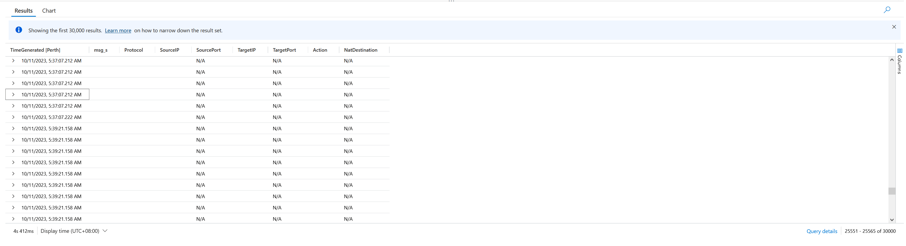

# Querying AzureDiagnostics Table for Firewall Logs using Kusto Query Language (KQL)

## Table of Contents

- [Querying AzureDiagnostics Table for Firewall Logs using Kusto Query Language (KQL)](#querying-azurediagnostics-table-for-firewall-logs-using-kusto-query-language-kql)
  - [Table of Contents](#table-of-contents)
  - [Introduction](#introduction)
  - [Prerequisites](#prerequisites)
  - [Writing KQL Queries](#writing-kql-queries)
  - [Querying Firewall Logs](#querying-firewall-logs)
  - [Sample Output](#sample-output)

## Introduction

Kusto Query Language (KQL) is a powerful tool for querying and analyzing data in Azure Log Analytics. In this guide, we will learn how to use KQL to query the AzureDiagnostics table for firewall logs and generate results in a table output.

## Prerequisites

Before you start, ensure you have the following:

- An Azure subscription with Log Analytics workspace.
- Access to the Azure portal.

## Writing KQL Queries

KQL is specifically designed for querying structured data. It allows you to retrieve, analyze, and visualize data. Queries are written using the `|` (pipe) operator to chain operations.

To learn more about how to write KQL queries and the various operators, refer to the [Microsoft Learn course](https://learn.microsoft.com/en-us/training/modules/write-first-query-kusto-query-language/).

## Querying Firewall Logs

1. **Open Log Analytics**: Log in to the [Azure portal](https://portal.azure.com/).

2. **Select Your Workspace**: Select the Log Analytics workspace where your firewall logs are stored.

3. **Open Logs**: In the workspace, navigate to "Logs" in the left menu.

4. **Select AzureDiagnostics Table**: Choose the "AzureDiagnostics" table. This table typically contains various diagnostics data, including firewall logs.


5. **Write Your Query**:

```kql
AzureDiagnostics
| where TimeGenerated > ago(1d)
| where 
    Category has_any ("AzureFirewallNetworkRule", "AZFWNetworkRule", "AzureFirewallApplicationRule", "AZFWApplicationRule", "AZFWNetworkRuleAggregation", "AZFWApplicationRuleAggregation", "AZFWNatRule", "AZFWNatRuleAggregation" )   // Include all Azure Firewall Rules
    and Category !has "AzureFirewallDnsProxy" or Category !has "AZFWDnsQuery"                                                                                                                                                           // Exclude DNS Proxy Logs 
| parse msg_s with Protocol " request from " SourceIP ":" SourcePortInt: int " to " TargetIP ":" TargetPortInt: int *
| parse msg_s with * ". Action: " Action1a
| parse msg_s with * " was " Action1b " to " NatDestination
| parse msg_s with Protocol2 " request from " SourceIP2 " to " TargetIP2 ". Action: " Action2
| extend SourcePort = tostring(SourcePortInt), TargetPort = tostring(TargetPortInt)
| extend
    Action = case(Action1a == "", case(Action1b == "", Action2, Action1b), Action1a),
    Protocol = case(Protocol == "", Protocol2, Protocol),
    SourceIP = case(SourceIP == "", SourceIP2, SourceIP),
    TargetIP = case(TargetIP == "", TargetIP2, TargetIP),
    SourcePort = case(SourcePort == "", "N/A", SourcePort),
    TargetPort = case(TargetPort == "", "N/A", TargetPort),
    NatDestination = case(NatDestination == "", "N/A", NatDestination)
| project
    TimeGenerated,
    msg_s,
    Protocol,
    SourceIP,
    SourcePort,
    TargetIP,
    TargetPort,
    Action,
    NatDestination
| where ( 
    has_any_ipv4_prefix(TargetIP, dynamic(["10.", "172.", "192."])) // Include Internal Traffic Only
    and 
    TargetPort !in ("7680", "53", "123")                            // Exclude specific services, e.g., WindowsUpdate, DNS, NTP
    and
    Protocol !contains ("ICMP")                                     // Exclude specific protocols, e.g., ICMP
    and
    Action has "Deny"                                               // Deny only 
    and  
    Action !contains "ThreatIntel"                                  // Exclude Blocked by MS intelligence-based filtering 
    )
| where (TargetPort != 443 and Protocol != 'UDP')                   // Exclude/Include HTTPS UDP
| distinct SourceIP, TargetIP, TargetPort, Protocol, Action
// | summarize by SourceIP, TargetIP, TargetPort, Protocol, Action
| sort by SourceIP                                         // If you need to Sort by TimeGenerated, add it to previous operator.

```

## Sample Output

